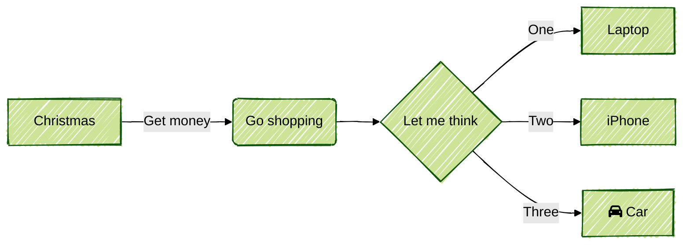

## quick start

Run following command to install current hugo theme, [even](https://github.com/olOwOlo/hugo-theme-even), which has not been maintained for a long time.

```shell
$ git clone https://github.com/olOwOlo/hugo-theme-even themes/even
```

NOTE: For this theme, you should use post instead of posts, namely `hugo new post/some-content.md`

> hugo version: v0.111.3+extended

remember to add following identifier refer to yandex email. 


